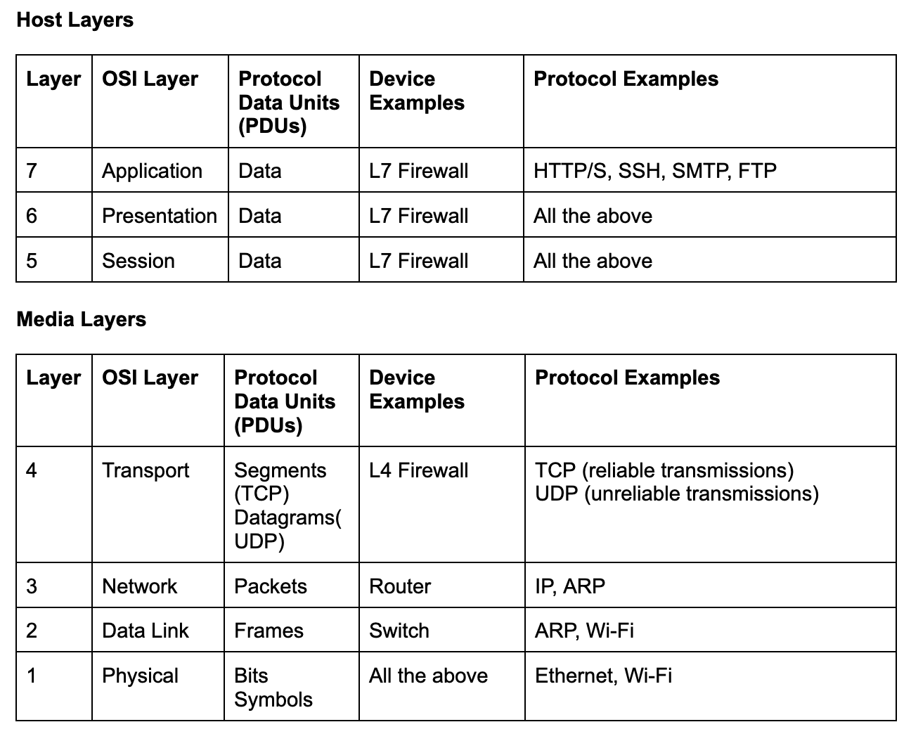
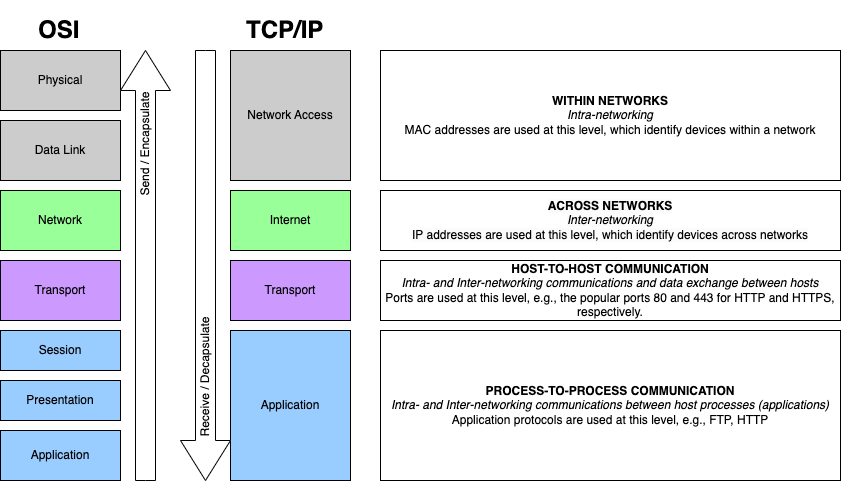
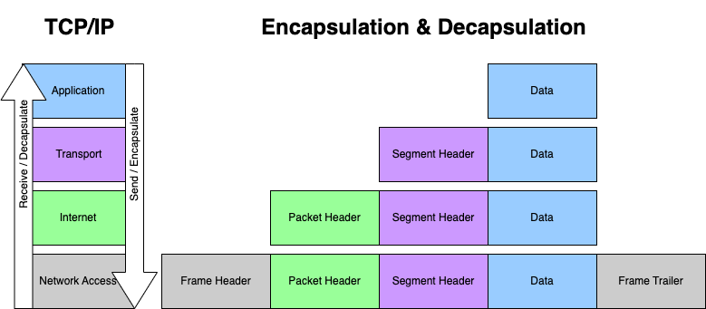

= Modèles de référence réseau
:customcss: styles.css

[.blue.background]
== Introduction

[.blue.background]
=== En apparence

Les réseaux peuvent sembler être l'un des domaines les plus obscurs de l'informatique. 

=== ...

Regorgeant de flux désordonnés de jargon incompréhensible, d'acronymes et de langage machine, il peut être difficile d'obtenir une compréhension solide de la communication réseau sans plonger dans ses fondements théoriques. 

[.blue.background]
=== La bonne nouvelle

La bonne nouvelle, c'est que cette plongée est moins effrayante que la plupart ne l'imaginent, en grande partie grâce à deux modèles conceptuels importants qui rendent ces communications infiniment plus compréhensibles.

[.blue.background]
== Les modèles de référence de réseau OSI et TCP/IP

Ce sont des modèles conceptuels qui fournissent des représentations abstraites de la manière dont les données sont transmises sur un réseau. 

[.blue.background]
=== Une "pile" de couches 

Chaque modèle est décrit par une "pile" de couches, ainsi appelée car chaque couche dépend de ses couches adjacentes, et ensemble elles ont une directionnalité implicite 

[.blue.background]
=== ...

Vous descendez dans la pile ou vous montez dans la pile. 

[.blue.background]
=== En bas de la pile

En bas de la pile, il y a l'électricité, des zéros et des uns, et des symboles, ces unités essentielles de l'électronique moderne.

[.blue.background]
=== En haut de la pile

En haut de la pile, il y a de jolies images et du texte riche dans votre navigateur et votre client de messagerie.

[.blue.background]
== ...

image::layers.png['layers']

[.blue.background]
==  Envoi de données

[.blue.background]
=== données descendantes et encapsulation

Les données descendant dans la pile (envoi de données) subissent une encapsulation, où chaque couche d'informations est enveloppée de détails supplémentaires et passée à la suivante. 

[.blue.background]
=== informations supplémentaires

Ces informations supplémentaires prennent généralement la forme d'en-têtes et/ou de trames - des détails ajoutés au début ou à la fin des unités de données reçues de la couche précédente. 

[.blue.background]
== Après l'envoi au système cible

Une fois entièrement encapsulées et envoyées le long du fil jusqu'au système cible, ces données remontent la pile, subissant une désencapsulation, où chaque couche interprétera et supprimera (dépouillera) ces informations supplémentaires jusqu'à ce qu'il ne reste que les données originales.

[.blue.background]
== Les couches

La pile OSI compte 7 couches, tandis que la pile TCP/IP en compte 4. 

Cependant, une fois que vous en connaissez une, vous connaissez pratiquement l'autre. 

[.blue.background]
== Le modèle OSI

[.blue.background]
=== Introduction

Le modèle OSI (Open Systems Interconnection) a été créé par l'ISO (Organisation internationale de normalisation) dans les années 1970 afin :

=== ...
[%step]
* d'organiser les efforts autour de la création de nouveaux protocoles réseau, 
* d'encourager le développement de systèmes pouvant interopérer indépendamment du fournisseur
* de fournir une perspective commune pour les protocoles réseau existants à l'époque. 

[.blue.background]
=== Normes parrainées

Au début du développement des réseaux, la plupart des normes étaient:
[%step]
* soit parrainées par le gouvernement, 
* soit des normes propriétaires développées par des fournisseurs, 

=== ...

ce qui enfermait les consommateurs dans un équipement particulier et des écosystèmes numériques spécifiques. 

[.blue.background]
=== OSI et description universelle

L'OSI a tenté de résoudre cela en proposant une description universelle des interactions entre diverses implémentations de protocoles réseau.

[.blue.background]
=== 7 couches

Le modèle OSI comprend 7 couches. 

[.blue.background]
=== Couches "médias" 

Les 4 couches inférieures sont appelées couches "médias" et comprennent les constructions les plus importantes  pour :
[%step]
* l'adressage, 
* le transport des données 
* la livraison des données. 

[.blue.background]
=== Couches "hôtes"

Les 3 couches supérieures sont appelées couches "hôtes" et reposent sur l'échafaudage infrastructurel fourni par les couches médias pour faciliter la communication entre les applications.

[.blue.background]
=== ...

[.blue.background]
=== ...

Explorons rapidement la fonction de chaque couche :

[.blue.background]
=== Couche 7 (Application) 

La couche d'interaction homme-machine.

Cette couche gère les services et programmes qui utilisent le réseau pour transmettre et recevoir des données, tels que les navigateurs web et les clients de messagerie.

[.blue.background]
== Couche 6 (Présentation) 

[.blue.background]
=== Concerne

Formatage et présentation des données.

[.blue.background]
=== Compression, chiffrement, encodage ...

Cette couche gère des éléments tels que la compression/décompression, le chiffrement/déchiffrement et l'encodage/décodage. 

[.blue.background]
=== Format utilisable ...

Fondamentalement, elle s'assure que les données sont dans un format utilisable pour la couche suivante (Couche 5 si on envoie des données, Couche 7 si on les reçoit).

[.blue.background]
== Couche 5 (Session) 

[.blue.background]
=== Concerne

Gestion des sessions de communication entre les appareils.

[.blue.background]
=== Sessions ...

Cette couche est responsable de l'établissement, du maintien et de la fermeture des sessions, ainsi que de l'exécution de fonctions telles que l'authentification et l'autorisation. 

[.blue.background]
=== Connexions ouvertes ...

Cela garantit que les connexions entre les clients restent ouvertes aussi longtemps que nécessaire pour transférer les données, puis sont fermées dès que le transfert est terminé.

[.blue.background]
== Couche 4 (Transport) - Transport des données entre les hôtes.

[.blue.background]
=== Concerne

C'est la couche qui gère les ports comme:
[%step]
* HTTP au port 80, 
* HTTPS au port 443. 

[.blue.background]
=== Livraison des données 

Étant responsable de la livraison des données, cette couche gère également:
[%step]
* la découpe des transferts de données volumineux en morceaux pour la livraison, 
* puis les reconstitue à l'autre extrémité.

[.blue.background]
=== Deux protocoles principaux 

Il existe deux protocoles principaux utilisés à cette couche : TCP et UDP.

[.blue.background]
=== TCP 

TCP envoie des segments de données et possède des mécanismes garantissant la livraison, tels que:
[%step]
* la vérification des paquets pour les erreurs
* la garantie qu'ils sont reçus dans le bon ordre
* la retransmission en cas de perte de paquets. 

[.blue.background]
=== ...

Cela garantit une communication de haute qualité, mais ces vérifications et équilibres se font au détriment de la vitesse. Si vous recherchez la vitesse  vous utilisez UDP.

[.blue.background]
=== UDP

UDP envoie des datagrammes et se fiche de savoir s'ils arrivent ou non.

Quelques paquets perdus ne risquent pas de ruiner votre série de victoires, vous pouvez donc vous passer de cette surcharge de vérification d'erreurs pour satisfaire votre besoin de vitesse.

[.blue.background]
== Couche 3 (Réseau) 

Transmission de données entre des appareils dans différents réseaux, c'est-à-dire le routage ! 

C'est le domaine des adresses IP, les adresses logiques attribuées aux hôtes.

[.blue.background]
=== Les routeurs 

Vous avez déjà entendu parler d'un routeur ? Les routeurs sont des dispositifs de la couche 3 qui permettent la communication entre les réseaux en routant des paquets entre ces dispositifs en fonction des adresses IP.

[.blue.background]
== Couche 2 (Liaison de données) 

Transmission de données entre des nœuds sur un réseau, c'est-à-dire la commutation. C'est le domaine des adresses MAC, les adresses physiques attribuées aux cartes réseau.

[.blue.background]
=== Le commutateur 

Vous avez déjà entendu parler d'un commutateur ? 

[.blue.background]
=== Dispositifs 
Les commutateurs sont des dispositifs de la couche 2 qui permettent la communication sur un réseau local en transférant des trames entre ces dispositifs. 

[.blue.background]
=== Trames

Vous avez déjà entendu parler de paquets ? Les trames sont comme des paquets, mais à la couche 2.

[.blue.background]
== Couche 1 (Physique) 

Transmission de données sur un support physique, tel qu'un câble ou une liaison sans fil.

Les éléments constitutifs des communications entre les appareils - signaux électriques et les diverses unités de données de bas niveau qu'ils représentent (bits, ou chiffres binaires, et symboles).

[.blue.background]
=== ...

image::./osi-layers-colors.png['osi-colors-layers']

[.blue.background]
== Astuce

Bien que principalement théoriques, vous entendrez souvent parler des couches OSI en référence aux dispositifs dans le monde des réseaux. 

[.blue.background]
=== Exemple

Par exemple, les commutateurs - ces dispositifs qui connectent les ordinateurs sur un réseau local - sont généralement des dispositifs de la couche 2. 

[.blue.background]
=== routage

Mais, avec le temps, les commutateurs ont été construits avec la capacité de router entre divers réseaux virtuels (VLAN). 

[.blue.background]
=== Routage

Rappelez-vous que le routage est une activité de la couche 3 qui utilise des paquets et est généralement le domaine des routeurs, et il est devenu nécessaire de distinguer entre un commutateur de la couche 2 et un commutateur de la couche 3.

[.blue.background]
== Les pare-feu

[.blue.background]
=== D'abord couche 3

De plus, les pare-feu ont connu une évolution similaire. Dans leurs premières années, ils étaient des filtres de paquets simples, opérant à la couche 3 (Réseau). 

[.blue.background]
=== Ensuite couche 4

Puis sont venus les routeurs de la couche 4, capables de suivre les états ou les connexions établies via TCP, une caractéristique essentielle de la couche de transport. 

[.blue.background]
=== Maintenant couche 7

De nos jours, nous avons des pare-feu de nouvelle génération qui peuvent effectuer un filtrage de la couche 7, renforçant davantage la nécessité de clarifier la couche avec laquelle le dispositif est capable de fonctionner.

[.blue.background]
== Discussions théoriques et académiques

Malgré le fait que le modèle OSI ne soit pas largement adopté pour des mises en œuvre pratiques, il reste un élément important dans les discussions théoriques et académiques. 

[.blue.background]
=== Il sert de :

En pratique, il sert de :
[%step]
* Cadre théorique complet pour comprendre les communications réseau.
* Carte logique des flux de données qui aide à isoler les causes des problèmes réseau lors du dépannage.
* Langage commun pour discuter des systèmes et des dispositifs réseau qui opèrent sur des couches spécifiques de données.

[.blue.background]
== Aide-mémoire

Il existe de nombreux acronymes disponibles pour aider à mémoriser ces couches. 

[.blue.background]
=== L7-L1

All People Seem To Need Data Processing

[.blue.background]
=== L1-L7

People Don’t Need Those Stupid Packets Anyway

[.blue.background]
== Le Modèle TCP/IP

Il simplifie en réalité la pile OSI en combinant plusieurs des couches que vous connaissez déjà.

[.blue.background]
=== Modèle pratique

Contrairement au modèle OSI théorique, le modèle TCP/IP est un modèle pratique qui se rapproche davantage des communications dans les réseaux modernes. 

[.blue.background]
=== Suite de protocoles Internet

Là où l'OSI n'a pas réussi à s'imposer pour des mises en œuvre pratiques, le modèle TCP/IP a conquis le domaine des communications en réseau modernes et a été officiellement mis en œuvre en tant que Suite de protocoles Internet, l'épine dorsale de l'Internet moderne. 

[.blue.background]
=== Exemple

Vous savez, comme IP, ce protocole de la couche OSI 3 (Réseau) qui gère le routage entre différents réseaux (c'est-à-dire l'inter-réseau).

[.blue.background]
=== Combinaison 

Étant donné que vous êtes familier avec le modèle OSI, il est facile de reconnaître celui-ci comme une version pratiquement abrégée de celui-ci. 

[.blue.background]
=== Le modèle TCP/IP combine 

[%step]
* les couches OSI 1-2 (Physique, Liaison de données) en une seule couche 1 (Accès au réseau)
* les couches 5-7 (Application, Présentation, Session) en une seule couche 4 (Application). 

[.blue.background]
=== ....

Il renomme également la couche Réseau (4) en Internet, reflétant ainsi son protocole titulaire. 

[.blue.background]
=== Les couches 

Couche 1 : Accès au réseau

Couche 2 : Internet

Couche 3 : Transport

Couche 4 : Application

[.blue.background]
=== Conseil 

Remarquez que les seules couches de ce modèle qui n'ont pas été fusionnées par rapport à l'OSI sont les protocoles TCP et IP éponymes (couches Transport et Réseau/Internet), ces concepts fondamentaux de la transmission de données et du routage. 

[.blue.background]
=== Passage 

Cela fournit un moyen facile de passer de l'OSI au TCP/IP.

[.blue.background]
=== ...

[.blue.background]
== Les avantages du modèle TCP/IP
En pratique, le modèle TCP/IP offre les avantages suivants :
[%step]
* Constitue la base de l'Internet et d'autres réseaux à grande échelle.
* Fournit une approche simplifiée et plus pratique des communications en réseau par rapport au modèle OSI.
* Sert de norme universelle pour la communication en réseau, en raison de son adoption généralisée et de sa mise en œuvre par une grande variété de dispositifs et d'applications.

[.blue.background]
=== ...

Souvenez-vous des détails sur l'encapsulation (descendre dans la pile ou envoyer des données) et la désencapsulation (remonter dans la pile ou recevoir des données) ? Vous savez, le processus d'ajout ou de suppression de données au début ou à la fin des unités de données transmises par d'autres couches ? 

[.blue.background]
=== ...

Voici à quoi cela ressemble, en référence au modèle TCP/IP.

[.blue.background]
== En conclusion

[.blue.background]
=== Les deux modèles sont utiles

Il est important de noter que ces modèles ne sont pas une situation de choix exclusif. 

Les deux sont utiles, et souvent utilisés en combinaison, plutôt qu'en exclusivité (comme vous le verrez dans la section suivante). 

[.blue.background]
=== L'importances de relations

Les couches sont importantes à comprendre, mais ce qui est encore plus important, c'est de comprendre les relations entre chacune d'entre elles. 

[.blue.background]
=== Ensuite, organiser les communications

Une fois que vous avez bien compris ces relations, il est facile d'organiser les communications que vous voyez comme relevant de fonctions particulières, plutôt que de numéros de couches spécifiques. 
